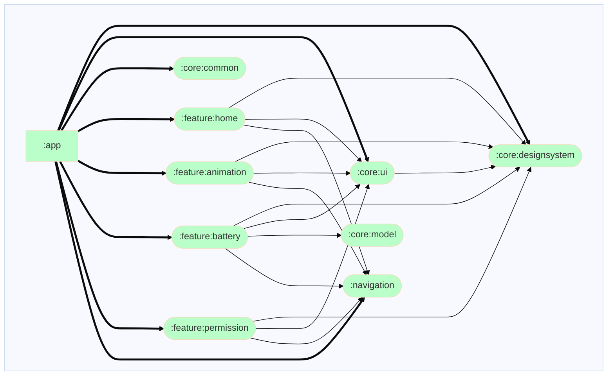

```mermaid
%%{ init: { 'theme': 'base' } }%%
graph LR;

%% Styling for module nodes by type
classDef rootNode stroke-width:4px;
classDef mppNode fill:#ffd2b3,color:#333333;
classDef andNode fill:#baffc9,color:#333333;
classDef javaNode fill:#ffb3ba,color:#333333;

%% Modules
subgraph  
  direction LR;
  :app[:app]:::andNode;
  :core:common([:core:common]):::andNode;
  :core:designsystem([:core:designsystem]):::andNode;
  :core:model([:core:model]):::andNode;
  :core:ui([:core:ui]):::andNode;
  :feature:animation([:feature:animation]):::andNode;
  :feature:battery([:feature:battery]):::andNode;
  :feature:home([:feature:home]):::andNode;
  :feature:permission([:feature:permission]):::andNode;
  :navigation([:navigation]):::andNode;
end

%% Dependencies
:app===>:core:designsystem
:app===>:core:ui
:app===>:core:common
:app===>:feature:home
:app===>:feature:animation
:app===>:feature:battery
:app===>:feature:permission
:app===>:navigation
:core:ui--->:core:designsystem
:feature:permission--->:core:designsystem
:feature:permission--->:core:ui
:feature:permission--->:navigation
:feature:battery--->:core:designsystem
:feature:battery--->:core:ui
:feature:battery--->:core:model
:feature:battery--->:navigation
:feature:animation--->:core:designsystem
:feature:animation--->:core:ui
:feature:animation--->:navigation
:feature:home--->:core:designsystem
:feature:home--->:core:ui
:feature:home--->:navigation

%% Dependents
```