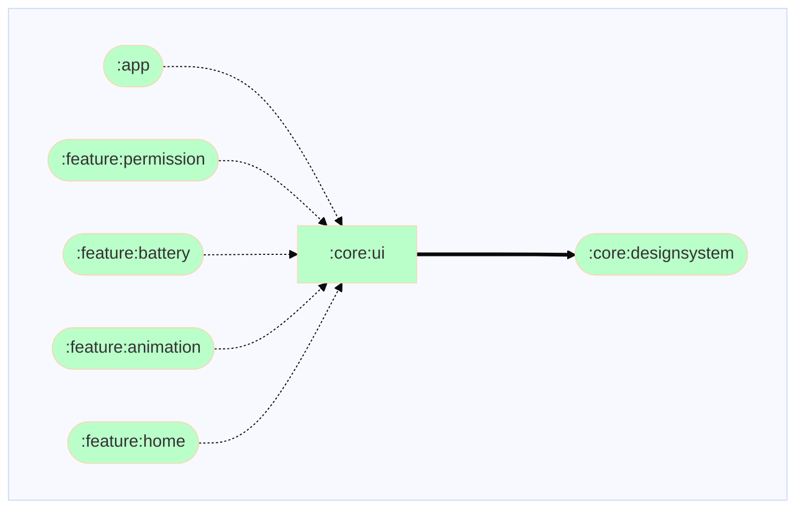

```mermaid
%%{ init: { 'theme': 'base' } }%%
graph LR;

%% Styling for module nodes by type
classDef rootNode stroke-width:4px;
classDef mppNode fill:#ffd2b3,color:#333333;
classDef andNode fill:#baffc9,color:#333333;
classDef javaNode fill:#ffb3ba,color:#333333;

%% Modules
subgraph  
  direction LR;
  :app([:app]):::andNode;
  :core:designsystem([:core:designsystem]):::andNode;
  :core:ui[:core:ui]:::andNode;
  :feature:animation([:feature:animation]):::andNode;
  :feature:battery([:feature:battery]):::andNode;
  :feature:home([:feature:home]):::andNode;
  :feature:permission([:feature:permission]):::andNode;
end

%% Dependencies
:core:ui===>:core:designsystem

%% Dependents
:app-.->:core:ui
:feature:permission-.->:core:ui
:feature:battery-.->:core:ui
:feature:animation-.->:core:ui
:feature:home-.->:core:ui
```