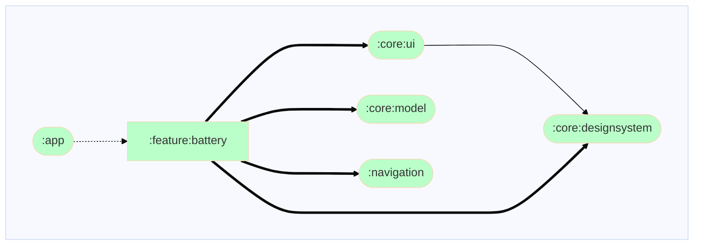

```mermaid
%%{ init: { 'theme': 'base' } }%%
graph LR;

%% Styling for module nodes by type
classDef rootNode stroke-width:4px;
classDef mppNode fill:#ffd2b3,color:#333333;
classDef andNode fill:#baffc9,color:#333333;
classDef javaNode fill:#ffb3ba,color:#333333;

%% Modules
subgraph  
  direction LR;
  :app([:app]):::andNode;
  :core:designsystem([:core:designsystem]):::andNode;
  :core:model([:core:model]):::andNode;
  :core:ui([:core:ui]):::andNode;
  :feature:battery[:feature:battery]:::andNode;
  :navigation([:navigation]):::andNode;
end

%% Dependencies
:core:ui--->:core:designsystem
:feature:battery===>:core:designsystem
:feature:battery===>:core:ui
:feature:battery===>:core:model
:feature:battery===>:navigation

%% Dependents
:app-.->:feature:battery
```